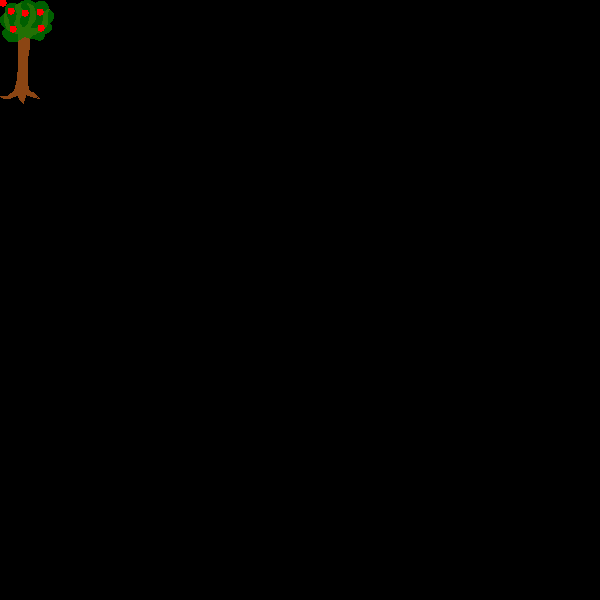

IIPIFFCPICCFPICICFFFIIPIFFCPICCFPICICFFFIICIICIICIPPPCFFFCCCCFFFCCCCFCCFFFFICFFCFCFCCFFFCFFICIPPCPIIC

IIPIFFCPICCFPICICFFFIIPIFFCPICCFPICICFFFIICIICIICIPPPFCFCCCCFFFFCFFFFFCFCCFFICFFCFFFFFFFICIPPCPIICe

AppleTree function starts at `3c870e` and its length is `372b`.
It draws an apple tree at the position.

Apple function starts at `65f785` and its length is `3fb`.

Here is a sample to draw an apple tree and an apple.

