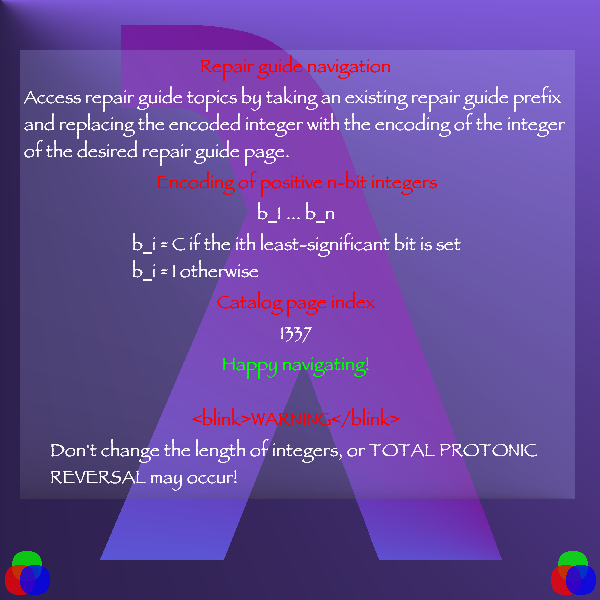

IIPIFFCPICFPPICIICCCIICIPPPCFIIC

```
IIPIFFCPICFPPICIICCCIICIPPPCFIIC
  ( cCIF PCFF P  )II  /ln00IC  /
                  ^^       ^^
```

This prefix is written in the repair guide. This page is not 1337, though.
Comparing with the prefix of repair guide, 'II' in the pattern and 'IC' in the template seem to figure the page.

```
( cCIF PCFF P  )II  /ln00IC  /
                  ^^       ^^
```

This prefix is written in the repair guide. This page is not 1337, though.
Comparing with the prefix of repair guide, 'II' in the pattern and 'IC' in the template seem to figure the page.


