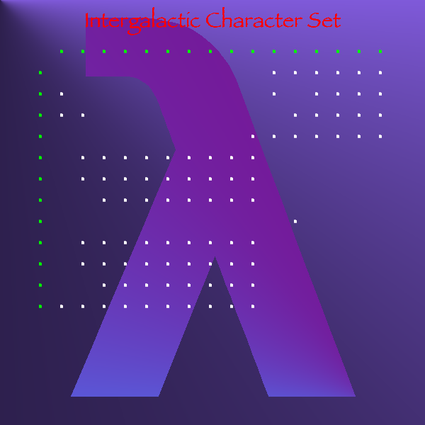

IIPIFFCPICFPPICIICCCCCCCCCCCCCCCIICIPPPCFFCFCCFFCCFCFIIC

## Charset

Guide 10646p from [index](index.md).

It shows a strange character set.
Some blogs say it is EBCDIC code table, but I don't want to depend on such online information.

