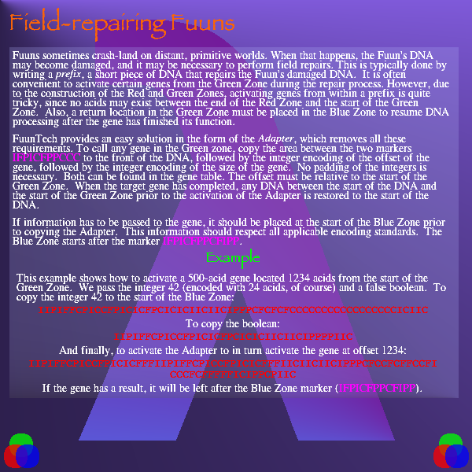

IIPIFFCPICFPPICIICCCCCCCCIICIPPPFCFCFCFIIC

```
IIPIFFCPICFPPICIICCCCCCCCIICIPPPFCFCFCFIIC
  ( cCIF PCFF P  )IIIIIII  /ln00CICICIC  /
```

Guide 85p.

## Field-repairing Fuuns

Fuuns sometimes crash-land on distant, primitive worlds. When that happens, the Fuun's DNA may become damaged, and it may be necessary to perform field repairs. This is typically done by writing a *prefix*, a short piece of DNA that repairs the Fuun's damaged DNA. It is often convenient to activate certain genes from the Green Zone during the repair process. However, due to the construction of the Red and Green Zones, activating genes from within a prefix is quite tricky, since no acids may exist between the end of the Red Zone and the Green Zone. Also, a return location in the Green Zone must be placed in the Blue Zone to resume DNA processing after the gene as finished its function.

FuunTech provides an easy solution in the form of the *Adapter*, which removes all these requirements. To call any gene in the Green zone, copy the area between the two markers `IFPICFPPCCC` to the front of the DNA, followed by the integer encoding of the offset of the gene, followed by the integer encoding of the size of the gene. No padding of the integers is necessary. Both can be found in the gene table. The offset must be relative to the start of the GreenZone. When the target gene has completed, any DNA between the start of the DNA and the start of the Green Zone prior to the activation of the Adapter is restored to the start of the DNA.

If information has to be passed to the gene, it should be placed at the start of the Blue Zone prior to copying the Adapter. This information should respect all applicable encoding standards. The Blue Zone starts after the marker `IFPICFPPCFIPP`.

### Example

This example shows how to activate a 500-acid gene located 1234 acids from the start of the Green Zone. We pass the integer 42 (encoded with 24 acids, of course) and a false boolean.

- To copy the integer 42 to the start of the Blue Zone:
```
IIPIFFCPICCFPICICFPCICICIICIICIPPPCFCFCFCCCCCCCCCCCCCCCCCICIIC
  ( cCIF PICF P PCFI P P  )  / n00ICICICIIIIIIIIIIIIIIIII P  /
                                  ^^^^^^^^^^^^^^^^^^^^^^^ ^
```
`^` indicates 24 acids, to figure an integer 42. Other parts look be usable generally.

- To copy the boolean:
```
IIPIFFCPICCFPICICFPCICICIICIICIPPPPIIC
  ( cCIF PICF P PCFI P P  )  / n00F  /
                                  ^
```
Looks same format with 42.

- And finally, to activate the Adapter to in turn activate the gene at offset 1234:
```
IIPIFFCPICCFPICICFFFIIPIFFCPICCFPICICFFFIICIICIICIPPPCFCCFCFFCCFICCCFCFFFFFICIPPCPIIC
  ( cCIF PICF P PCCC  ( cCIF PICF P PCCC  )  )  / n00       1234        500   n0 1  /
                                                     ^^^^^^^^^^^  ^^^^^^^^^
````
Two integers are indicated with `^`. The first one is 1234, which means the starting offset address, and the second one is 500, the length.


If the gene has a result, it will be left after the Blue Zone marker (`IFPICFPPCFIPP`).



