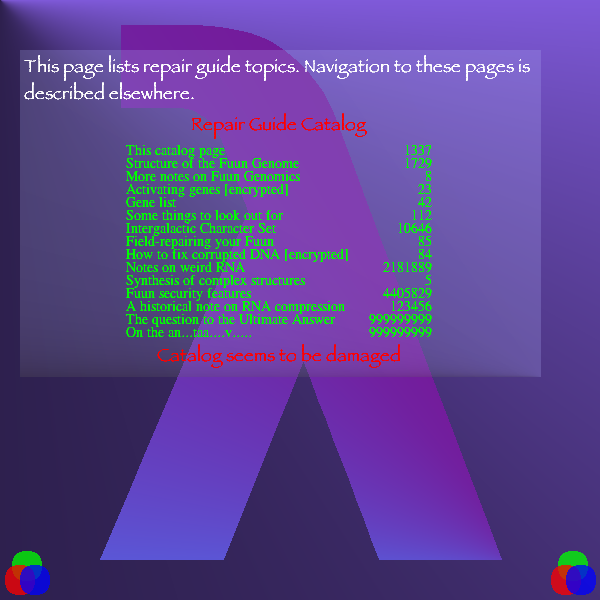

IIPIFFCPICFPPICIICCCCCCCCCCCCIICIPPPFCCFFFCCFCFIIC

```
IIPIFFCPICFPPICIICCCCCCCCCCCCIICIPPPFCCFFFCCFCFIIC
  ( cCIF PCFF P  )IIIIIIIIIII  /ln00CIICCCIICIC  /
                                    ^^^^^^^^^^^
```

Following the guess in catalog, try to take the page 1337.
1337 = `0b0b10100111001` should be `"CIICCCIICIC"`.

This content is index of pages, and it says some pages are broken or not visible.

- This catalog page: [1337](catalog.md)
- Structure of the Fuun Genome: [1729](structure.md)
- More notes on Fuun Genomics: [8](encodings.md)
- Activating genes [encrypted]: 23
- Gene list: [42](list.md)
- Some things look out for: [112](lookout.md)
- Intergalactic Character Set: [10646](charset.md)
- Field-repairing your Fuun: [85](field.md)
- How to fix corrupted DNA [encrypted]: 84
- Notes on weird RNA: [2181889](notes.md)
- Synthesis of complex structures: [5](lsystems.md)
- Fuun security features: [4405829](security.md)
- A historical note on RNA compression: 123456
- The question to the Ultimate Answer: 999999999


