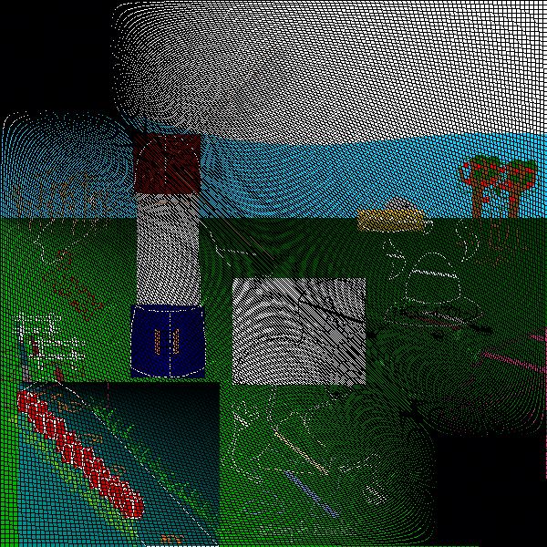

IIPIFFCPICPCIICICIICIPPPPIIC

```
IIPIFFCPICPCIICICIICIPPPPIIC
  ( sCIF PFI  ) P  / n00F  /
```

This prefix is written in repair guide. This makes the picture bright.

```
risk: 1160658 (10*116063+28)
```


