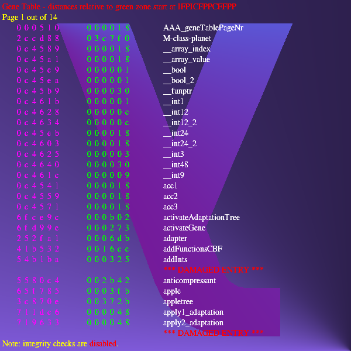

IIPIFFCPICFPPICIICCCCCCCIICIPPPCFCFCFIIC

```
IIPIFFCPICFPPICIICCCCCCCIICIPPPCFCFCFIIC
  ( cCIF PCFF P  )IIIIII  /ln00ICICIC  /
```

## Gene list

Guide 42p.

```
Gene Table - distances relatvie to green zone start at IFPICFPPCFFPP

Pate 1 out of 14
 red     green
000510  000018  AAA_geneTablePageNr
2ccd88  03c7f0  M-class-planet
0c4589  000018  __array_index
0c45a1  000018  __array_value
0c45e9  000001  __bool
0c45ea  000001  __bool_2
0c45b9  000030  __funptr
0c461b  000001  __int1
0c4628  00000c  __int12
0c4634  00000c  __int12_2
0c45eb  000018  __int24
0c4603  000018  __int24_2
0c4625  000003  __int3
0c4640  000030  __int48
0c461c  000009  __int9
0c4541  000018  acc1
0c4559  000018  acc2
0c4571  000018  acc3
6fce9c  000b02  activateAdaptionTree
6fd99e  000273  activate?ene
252fa1  0006db  adapter
41b532  0016ce  addFunctionCBF
54b1ba  000325  addInts
                ** DAMAGED ENTRY ***
5580c4  002b42  anticompressant
65f785  0003fb  apple
3c870e  00372b  appletree
711dc6  000048  apply1_adaptation
719633  000048  apply2_adaptation
                ** DAMAGED ENTRY ***
```


