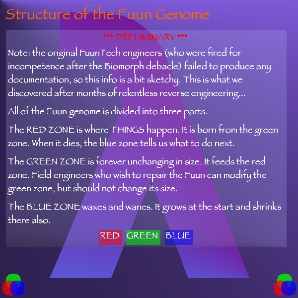

IIPIFFCPICFPPICIICCCCCCCCCCCCIICIPPPFCCCCCFFCFFIIC

```
IIPIFFCPICFPPICIICCCCCCCCCCCCIICIPPPFCCCCCFFCFFIIC
  ( cCIF PCFF P  )IIIIIIIIIII  /ln00CIIIIICCICC  /
```

要するにFuunの遺伝子は3種類のエリアから成ってる。
赤は可変エリア。実行命令が書かれてる。
緑は普遍エリア。手順的には書き換えられるけど書き換えないのおすすめ。
青はその他。実行命令のあまりとかそういうのが来る。



