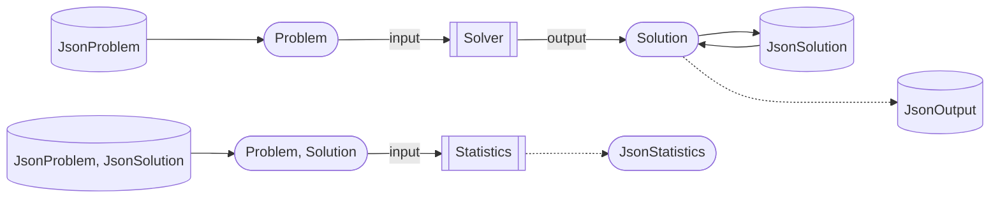

# プログラムデザインメモ

データの流れをこうしようと思っている概要図

```mermaid
flowchart LR
    id1[(JsonProblem)] --> id2([Problem])
    id2 -- input --> id3[[Solver]] -- output --> id4([Solution])
    id4 --> id5[(JsonSolution)] --> id4
    id4 -..-> id6[(JsonOutput)]

    fl1[(JsonProblem, JsonSolution)] --> fl2([Problem, Solution])
    fl2 -- input --> fl3[[Statistics]] -.-> fl4([JsonStatistics])
```
